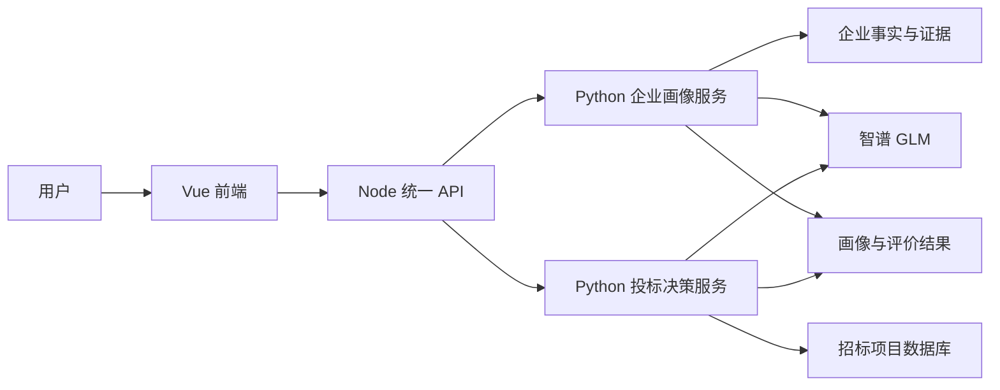

# 企业画像与投标辅助决策智能体

面向招投标场景的辅助决策系统。系统整理企业资料，生成企业画像与指标评价，再结合招标项目的资格要求和资源约束，帮助用户比较投标机会。

完整运行需要企业数据、项目数据库和智谱 GLM 服务。本仓库不包含业务数据和访问凭据。

## 项目做了什么

| 功能 | 用户得到什么 | 系统怎样处理 |
|---|---|---|
| 企业画像 | 企业事实、能力和经营偏好的集中展示 | 读取企业事实与证据，生成能力描述；资料不足时提示用户补充并更新画像 |
| 企业评价 | 指标得分、评分理由和待完善项 | 按度量模型选定的 44 项指标执行规则评价；未取得的数据与已评分数据分开呈现 |
| 投标决策 | 资格结论、项目比较、评分依据和行动建议 | 读取招标项目，核验资格三态，再比较企业能力、可用资源和本次目标 |
| 竞争分析 | 目标项目的竞争概览 | 区分真实信息与演示信息，后者不作为真实参与证据或评分依据 |

核心流程是：**企业资料 → 画像与评价 → 项目资格核验 → 单/多项目比较 → 可追溯的决策建议**。它提供辅助判断，不代替企业作最终投标决定，也不预测精确中标概率。

## 系统结构



前端使用 Vue、TypeScript、Pinia 和 Vite；Node 服务负责统一 API 与请求转发；两个 Python 服务分别承载画像和投标决策。Agent 流程使用 LangGraph 的节点、状态和条件分支，模型接入智谱 GLM。当前部署方式为 Windows 本机运行，四个服务只监听 `127.0.0.1`。详见 [系统架构](docs/ARCHITECTURE.md)。

## Agent 如何设计

项目没有让大模型自由决定所有步骤，而是把**流程控制、确定性规则和模型任务**分开：

1. **画像 Agent** 先读取事实、标签、能力和经营偏好，再按状态决定是否进行能力语义分析、检查缺口、向用户提问、接收补充并复查。运行状态和节点轨迹可用于定位失败环节。实现见 [画像工作流](services/profile_agent_api/langgraph/graph.py) 和 [状态定义](services/profile_agent_api/langgraph/state.py)。
2. **投标决策 Agent** 读取画像和项目，解析用户本次目标，核验资格，处理关键未知项，进行比较、结果校验和解释。实现见 [投标工作流](src/bid_decision_agent/graph.py)。
3. **Prompt 规定边界，Schema 规定格式，程序校验结果。** 画像语义分析只能引用允许的事实与证据，不能新增企业事实或直接打分；投标解释不能篡改资格、客观分、项目选择或证据编号。参见 [画像 Prompt](config/prompts/enterprise_capability_semantic_prompt_v1.json) 和 [投标 Prompt](src/bid_decision_agent/prompts.py)。

智谱 GLM 主要处理自然语言目标、能力语义和结论说明；评分、资格硬约束及资源冲突不能仅凭模型生成文本决定。

## 评分与决策边界

企业评价与投标项目评分是**两个不同问题**：

- **企业评价**关注企业自身。指标选择配置保留 44 项、排除 16 项；每项尽量给出得分依据，缺项与有效数据不混为一谈。配置见 [指标选择](config/evaluation_indicator_selection.json) 和 [评价规则](config/evaluation_scoring_rules.json)。
- **投标项目评分**关注“同一企业面对某个项目是否值得投”。当前 `TEMP-BID-SCORE-V2` 为资格 40 分、能力匹配 40 分、资源可执行性 20 分。它是当前项目横向比较用的临时规则，**不是正式推荐算法或中标概率**。详见 [评分细则](docs/TEMP_BID_SCORE_V2.md)。

资格按 `PASS`（证据支持满足）、`FAIL`（证据支持不满足）、`UNKNOWN`（证据不足）三态处理。`FAIL` 不能被高分或模型解释覆盖；`UNKNOWN` 不能被说成通过。多项目比较还检查团队槽位与关键人员冲突。

## 数据与运行边界

- 企业源文件为本地只读快照；用户补充、派生画像和运行结果分别存储，不改写原始资料。本仓库不包含企业快照。
- 招标项目从远程 MySQL 读取。没有数据库连接时，系统不会将虚构项目当作真实查询结果。
- 启动检查会验证企业数据、项目读取和 GLM 结构化调用；关键依赖不可用时，完整业务不会启动。
- 当前竞争者关系数据不足，竞争分析中的演示信息会单独标记，且不参与客观评分。
- 当前未实现登录权限、学习排序和精确中标概率预测。

运行数据分区见 [存储说明](docs/STORAGE_LAYOUT.md)。

## 本机运行

环境要求为 Windows 10/11、Python 3.11、Node.js 18+，以及企业数据、项目数据库和智谱 GLM 配置。复制 `.env.example` 为 `.env.local`，填写配置，建立 SSH 隧道，然后在项目根目录运行：

```powershell
.\start.ps1
```

脚本依次安装锁定依赖、执行数据与服务预检、启动四个本地服务并做健康检查。完整步骤见 [Windows 运行手册](docs/WINDOWS_RUNBOOK.md)。
