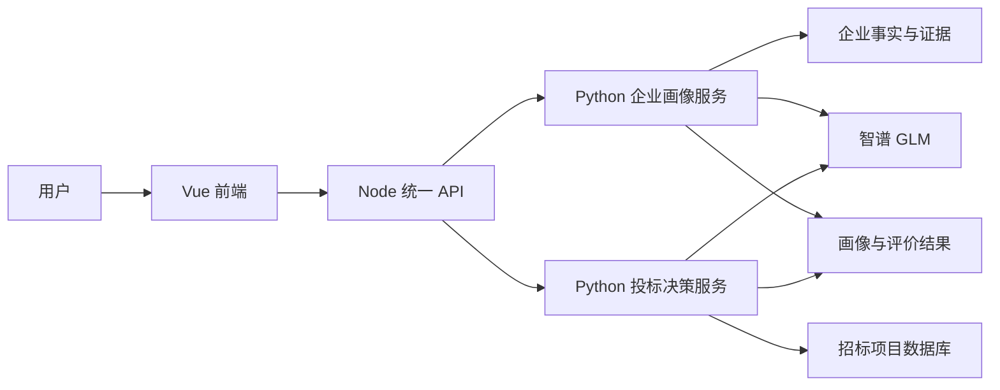

# 企业画像与投标辅助决策智能体

一个面向招投标业务的团队项目：把企业资料整理为可追溯的画像和评价，再结合项目要求、投标资格与资源约束，辅助用户比较和选择投标项目。

> 这是项目的源码展示版。真实企业快照、远程数据库凭据、智谱 GLM API Key 和运行记录不随公开仓库发布。因此，仅下载源码**不能直接运行完整业务**；系统也不会在真实依赖缺失时悄悄切换成模拟结论。

## 项目做了什么

| 功能 | 用户得到什么 | 系统怎样处理 |
|---|---|---|
| 企业画像 | 企业事实、能力和经营偏好的集中展示 | 读取企业事实与证据，生成能力描述；资料不足时提示用户补充并更新画像 |
| 企业评价 | 指标得分、评分理由和待完善项 | 按度量模型选定的 44 项指标执行规则评价；未取得的数据与已评分数据分开呈现 |
| 投标决策 | 资格结论、项目比较、评分依据和行动建议 | 读取招标项目，核验资格三态，再比较企业能力、可用资源和本次目标 |
| 竞争分析 | 竞争信息展示及其数据边界 | 当前竞争者关系缺少可用真实记录，演示竞争信息单独标记，不作为真实参与证据或客观评分依据 |

核心流程是：**企业资料 → 画像与评价 → 项目资格核验 → 单/多项目比较 → 可追溯的决策建议**。它提供辅助判断，不代替企业作最终投标决定，也不预测精确中标概率。

## 系统结构



前端使用 Vue、TypeScript、Pinia 和 Vite；Node 服务负责统一 API 与请求转发；两个 Python 服务分别承载画像和投标决策。Agent 流程使用 LangGraph 的节点、状态和条件分支，模型接入智谱 GLM。原项目在 Windows 本机运行，四个服务只监听 `127.0.0.1`。详见 [系统架构](docs/ARCHITECTURE.md)。

## Agent 如何设计

项目没有让大模型自由决定所有步骤，而是把**流程控制、确定性规则和模型任务**分开：

1. **画像 Agent** 先读取事实、标签、能力和经营偏好，再按状态决定是否进行能力语义分析、检查缺口、向用户提问、接收补充并复查。运行状态和节点轨迹可用于定位失败环节。实现见 [画像工作流](services/profile_agent_api/langgraph/graph.py) 和 [状态定义](services/profile_agent_api/langgraph/state.py)。
2. **投标决策 Agent** 读取画像和项目，解析用户本次目标，核验资格，处理关键未知项，进行比较、结果校验和解释。实现见 [投标工作流](src/bid_decision_agent/graph.py)。
3. **Prompt 规定边界，Schema 规定格式，程序校验结果。** 画像语义分析只能引用允许的事实与证据，不能新增企业事实或直接打分；投标解释不能篡改资格、客观分、项目选择或证据编号。参见 [画像 Prompt](config/prompts/enterprise_capability_semantic_prompt_v1.json) 和 [投标 Prompt](src/bid_decision_agent/prompts.py)。

智谱 GLM 主要处理自然语言目标、能力语义和结论说明；评分、资格硬约束及资源冲突不能仅凭模型生成文本决定。

## 评分与决策边界

企业评价与投标项目评分是**两个不同问题**：

- **企业评价**关注企业自身。指标选择配置保留 44 项、排除 16 项；每项尽量给出得分依据，缺项与有效数据不混为一谈。配置见 [指标选择](config/evaluation_indicator_selection.json) 和 [评价规则](config/evaluation_scoring_rules.json)。
- **投标项目评分**关注“同一企业面对某个项目是否值得投”。当前 `TEMP-BID-SCORE-V2` 为资格 40 分、能力匹配 40 分、资源可执行性 20 分。它是当前项目横向比较用的临时规则，**不是正式推荐算法或中标概率**。详见 [评分细则](docs/TEMP_BID_SCORE_V2.md)。

资格按 `PASS`（证据支持满足）、`FAIL`（证据支持不满足）、`UNKNOWN`（证据不足）三态处理。`FAIL` 不能被高分或模型解释覆盖；`UNKNOWN` 不能被说成通过。多项目比较还检查团队槽位与关键人员冲突。

## 数据、复现与已知限制

- 原项目的企业源文件是本地只读真实快照；用户补充、派生画像与运行结果分别存储，避免改写原始资料。公开仓库不包含这些真实数据。
- 项目列表原本从远程 MySQL 获取，需获授权的数据库账号和用户手工建立的 SSH 隧道。代码不会用虚构项目替代连接失败。
- 启动检查会验证原项目使用的 117 家企业快照、数据库项目读取和一次智谱 GLM 结构化调用；任一关键依赖失败即不启动完整业务。这意味着公开源码目前**不是开箱即用的离线 Demo**。
- 竞争者关系数据不足，当前独立的演示竞争信息仅用于验证交互流程，页面和结果均应标注数据性质；它不参加客观评分。
- 当前没有实现登录权限体系、Top 20 学习排序或精确中标概率预测。

真实数据与密钥被 `.gitignore` 排除。提交前仍应检查暂存文件，尤其不要把 `.env.local`、`runtime_data/` 或个人资料强制加入 Git。有关运行数据分区，见 [存储说明](docs/STORAGE_LAYOUT.md)。

## 本机运行（需要获授权的依赖）

原项目要求 Windows 10/11、Python 3.11、Node.js 18+，以及可用的企业数据、项目数据库和智谱 GLM 配置。取得授权后，复制 `.env.example` 为 `.env.local`，填写配置，手工建立 SSH 隧道，然后在项目根目录运行：

```powershell
.\start.ps1
```

脚本依次安装锁定依赖、执行真实数据与服务预检、启动四个本地服务并做健康检查。完整步骤见 [Windows 运行手册](docs/WINDOWS_RUNBOOK.md)。**没有上述授权数据和配置时，不建议仅为了展示而填写假密钥或编造运行结果。**

## 项目分工与说明

这是团队协作项目，不应将完整系统描述为单人独立开发。个人简历中可据实际工作说明参与的前端交互、画像与评价流程联调、真实数据接入后的问题排查，以及投标决策链路的集成与验收；Agent 后端和数据采集等模块的具体贡献应按实际分工标注。

本仓库保留实现与设计边界，未附真实企业数据、授权数据库或模型密钥。公开代码或添加开源许可证前，还应确认团队及数据提供方的发布许可。
